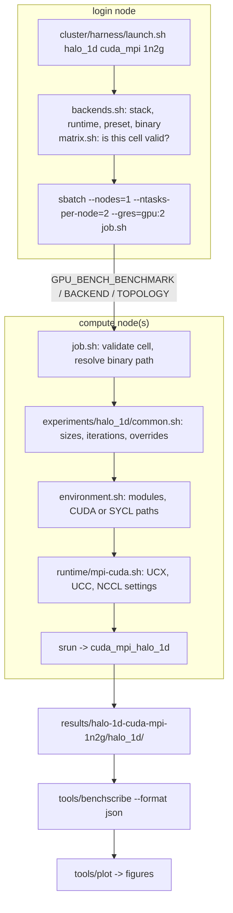
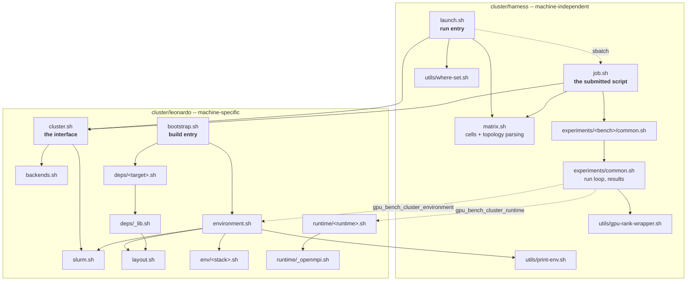

# Leonardo

Leonardo uses different validated software stacks for native CUDA and SYCL-on-NVIDIA runs. Select the stack explicitly before configuring or submitting jobs.

## Setup

From a clean clone, build the external libraries before any benchmark:

```bash
./cluster/leonardo/bootstrap.sh
```

It resolves target order itself and builds patched OSHMPI, then oneCCL with the OSHMPI
backend, then the `leonardo-sycl-oneccl-oshmpi` benchmarks. Targets live in
[`deps/`](deps/); each declares the stack it needs, what it requires, and a path that
proves it is already built, so re-running skips finished work.

```bash
./cluster/leonardo/bootstrap.sh --list           # available targets
./cluster/leonardo/bootstrap.sh oneccl-oshmpi    # one target and its dependencies
GPU_BENCH_FORCE=1 ./cluster/leonardo/bootstrap.sh oneccl-oshmpi   # rebuild anyway
```

The only prerequisite it cannot install is a **DPC++ compiler**. Point `DPCPP_HOME` at
one (default `$HOME/opt/dpcpp_6.3`).

### Where things go

[`layout.sh`](layout.sh) is the single definition of every path the bootstrap produces
and every path the runtime scripts consume, so the two cannot drift:

| Variable | Default | Holds |
| --- | --- | --- |
| `GPU_BENCH_WORK_ROOT` | `$SCRATCH/gpu-comm-bench` | clones and build trees - large, disposable |
| `GPU_BENCH_PREFIX_ROOT` | `$HOME/opt/gpu-comm-bench` | install prefixes - small, persistent, resolved by jobs at run time |

Relocate everything by setting one of those. Individual prefixes (`OSHMPI_HOME`,
`ONECCL_OSHMPI_ROOT`, `ONECCL_NCCL_ROOT`) are respected if already exported, for one-off
experiments. Nothing else defines them - two definitions with different defaults would
resolve by source order, which is how a build ends up linking one install's headers
against another's libraries.

`environment.sh` sources `layout.sh`, so `make leonardo` and the bootstrap agree on
every path.

### oneCCL with the NCCL backend

`leonardo-sycl-oneccl` needs oneCCL built with the **NCCL** backend at
`$ONECCL_NCCL_ROOT`, produced by `deps/oneccl-nccl.sh`.

It links oneCCL's *bundled Intel MPI*, not Leonardo's Open MPI: the executables call
MPI directly for setup and validation, so their linked MPI and the one oneCCL dlopens
must be the same, and mixing the two fails during transport initialization. The
preset therefore sets `GPU_BENCH_ONECCL_USE_BUNDLED_MPI=ON`, and the jobs launch with
`mpirun` rather than `srun` so the launcher comes from that same stack.
`runtime/oneccl-nccl.sh` documents the multi-node OFI settings this requires.

## CUDA Stack

```bash
source cluster/leonardo/environment.sh cuda
cmake --preset leonardo-cuda-mpi
cmake --build --preset leonardo-cuda-mpi
```

This stack is based on `nvhpc/24.5`, `hpcx-mpi/2.19`, CUDA 12.4 from NVHPC, and NVHPC-provided NCCL/NVSHMEM.

Other CUDA presets:

```bash
cmake --preset leonardo-cuda-nccl && cmake --build --preset leonardo-cuda-nccl
cmake --preset leonardo-cuda-nvshmem && cmake --build --preset leonardo-cuda-nvshmem
cmake --preset leonardo-oshmpi && cmake --build --preset leonardo-oshmpi
```

## SYCL Stack

```bash
source cluster/leonardo/environment.sh sycl
cmake --preset leonardo-sycl-mpi
cmake --build --preset leonardo-sycl-mpi
```

This stack is based on `gcc/12.2.0`, `cuda/12.2`, `openmpi/4.1.6`, and a custom DPC++ install at `$HOME/opt/dpcpp_6.3`.

oneCCL preset:

```bash
cmake --preset leonardo-sycl-oneccl
cmake --build --preset leonardo-sycl-oneccl
```


## How experiments are defined

One job script, `cluster/harness/job.sh`, serves every
(benchmark, backend, topology) cell. It replaced 230 near-identical per-cell
scripts that differed only in values derivable from those three names.

| file | holds |
| --- | --- |
| `launcher/job.sh` | the submitted script: resolve, validate, dispatch |
| `launcher/backends.sh` | per-backend constants (stack, runtime, launcher, preset, binary) |
| `launcher/matrix.sh` | which cells are valid, and why each exclusion exists |
| `experiments/<bench>/common.sh` | per-benchmark defaults and arguments |

The allocation shape is not baked into a file: `--nodes`, `--ntasks-per-node`,
`--gres`, `--time` and `--job-name` are passed on the sbatch command line, which
takes precedence over `#SBATCH` directives. Nothing is generated, so there is
nothing to regenerate or keep in sync.

Adding a topology is a one-line edit in `matrix.sh`. Adding a backend is one row
in `backends.sh` plus its name in the benchmarks that support it.

### Flow of one experiment



The environment is layered in that order, each layer using `${VAR:-default}`, so
**an earlier layer wins**. A benchmark that needs UCC off says so once in its
`common.sh`, and `runtime/*.sh` leaves it alone. `cluster/harness/launch.sh --explain`
prints the resolved value of every variable together with the file that wrote it.

### Layout

The tree separates *what runs* from *where it runs*.

```
cluster/
  harness/              MACHINE-INDEPENDENT -- the same on every cluster
    launch.sh           run entry point
    job.sh              the submitted script
    matrix.sh           which (benchmark, backend, topology) cells exist
    experiments/        what is measured -- sizes, iterations, overrides
    utils/              print-env, where-set, gpu-rank-wrapper

  leonardo/             MACHINE-SPECIFIC -- one directory per cluster
    cluster.sh          the interface the harness talks to
    backends.sh         which backends exist here, and their presets
    slurm.sh            account and partition
    layout.sh           install prefixes under $SCRATCH
    env/                BUILD environment -- modules, compilers
    runtime/            RUN environment -- UCX, UCC, NCCL, per library
    deps/               third-party builds (the oneCCL fork)
    bootstrap.sh        build entry point
```

`GPU_BENCH_CLUSTER` selects the machine (default `leonardo`), and the harness
reaches it only through `cluster/<name>/cluster.sh`. Adding a second cluster
means writing one `cluster.sh`, an `env/`, and a `runtime/` -- and changing
nothing under `harness/`.

`cluster.sh` must provide:

| name | purpose |
| --- | --- |
| `SBATCH_ACCOUNT`, `SBATCH_PARTITION` | submission defaults |
| `gpu_bench_backend_fields <backend>` | stack, runtime, launcher, preset, bindir, prefix |
| `gpu_bench_backend_names` | which backends this machine can run |
| `gpu_bench_walltime_for <nodes>` | queue policy |
| `gpu_bench_cluster_environment <stack>` | modules, compilers, library paths |
| `gpu_bench_cluster_runtime <runtime>` | comm-library settings for a run |
| `gpu_bench_cluster_env_files <stack> <runtime>` | those files in order, for `--explain` |

### Which script sources which



Reading it:

- **Every arrow from harness to cluster passes through `cluster.sh`.** That is
  the whole boundary; the harness names no module, no partition, no preset.
- **`matrix.sh` is submit-time only.** `job.sh` uses it for topology parsing, not
  to ask which cells exist -- it was already given one.
- **`runtime/_openmpi.sh` is shared by the four MPI-backed runtimes** and by
  neither oneCCL runtime, which have their own transport.
- **Two entry points:** `harness/launch.sh` runs, `leonardo/bootstrap.sh` builds.

### One MPI: HPC-X 2.19

Everything that calls MPI directly links the same bundle -- `cuda_mpi`,
`sycl_mpi`, `oshmpi`, and the OSHMPI that `sycl_oneccl_oshmpi` sits on. So a
`cuda_mpi` vs `sycl_mpi` comparison measures the programming model, by
construction rather than by caveat. Two exceptions, both deliberate:
`sycl_oneccl` links oneCCL's bundled Intel MPI (its executables must link the
same MPI oneCCL dlopens), and NCCL/NVSHMEM do not use MPI for data movement.

The prefix is discovered by asking a login shell for `$HPCX_MPI_HOME`; the
`hpcx-mpi` module is never loaded into the SYCL environment, because it pulls in
nvhpc and would replace DPC++ and CUDA 12.2.

**Why not the cluster's `openmpi/4.1.6`.** It has no UCC, and Open MPI's built-in
`tuned` collectives reduce with host `ompi_op` functions, so an allreduce on
device buffers stages through host memory at a flat 0.42 GB/s whatever the size:

| 1n2g allreduce, 16 MiB | time | bandwidth |
| --- | ---: | ---: |
| HPC-X 2.19 (`cuda_mpi`) | 225.4 us | 74.43 GB/s |
| HPC-X 2.19 (`sycl_mpi`) | 224.6 us | 74.69 GB/s |
| openmpi/4.1.6 (`sycl_mpi`) | 39710 us | 0.42 GB/s |

`alltoall`, which moves bytes without reducing them, matched `cuda_mpi` to within
a few percent under *either* MPI -- which is what identifies the missing
device-side reduction as the cause rather than the programming model. Measured
2026-08-26; to reproduce, load `openmpi/4.1.6--gcc--12.2.0-cuda-12.2` in
`env/sycl.sh` in place of the HPC-X block and run into a separate results tree
(`GPU_BENCH_RESULTS_ROOT`), never the default one -- benchscribe keys on
`(benchmark, backend, topology)` and would average the two together.

Using HPC-X outside its module means supplying five things it would have set.
`env/sycl.sh` does all of them; they are listed because four fail in ways that do
not name the cause, and the fifth does not fail at all:

| what | symptom if missing |
| --- | --- |
| the `ompi` prefix on `PATH` | CMake finds another `mpicxx`; nothing changes |
| `OPAL_PREFIX` | no MCA components; failure inside `MPI_Init` |
| `OMPI_CC` / `OMPI_CXX` | wrappers call `nvc`, absent here: *"C compiler cannot create executables"* |
| `$HPCX_ROOT/ucx/lib` | loads system UCX 1.15, warns, PML never initialises |
| `$HPCX_ROOT/ucc/lib` | `libucc.so.1 => not found`; **silent** -- plausible, wrong numbers |

Every job log records `OPAL_PREFIX`, so a result can be traced to the MPI that
produced it.

### Why `runtime/` is not inside `experiments/`

`env/` and `runtime/` are a pair, and both describe **this machine**:

| directory | answers | example |
| --- | --- | --- |
| `env/` | how do I *build* for this stack here? | `module load nvhpc/24.5`, `CXX=nvc++` |
| `runtime/` | how is this library *configured* here? | `OMPI_MCA_coll_ucc_enable`, `UCX_TLS` |
| `experiments/` | what are we measuring? | matrix, message sizes, iteration counts |

One `runtime/oshmpi.sh` serves all six benchmarks, so it belongs to no single one.
Moving it under `experiments/` would separate it from `env/`, which it is paired
with, and leave it owned by nothing in particular.

## Experiments

Experiment scripts are fixed-topology Slurm launchers. They write Slurm logs under `logs/` and benchmark outputs under `results/<result-name>/<problem>/`.
The active suite is `pingpong`, `halo_1d`, `allreduce`, `alltoall`, `cg_step`, and `moe`.

Halo 1D:

```bash
cluster/harness/launch.sh halo_1d cuda_mpi 1n4g
cluster/harness/launch.sh halo_1d cuda_nccl 1n4g
cluster/harness/launch.sh halo_1d cuda_nvshmem 1n4g
cluster/harness/launch.sh halo_1d oshmpi 1n4g
cluster/harness/launch.sh halo_1d sycl_mpi 1n4g
cluster/harness/launch.sh halo_1d sycl_oneccl 1n4g
```

Allreduce (collective sum latency/bandwidth, internal size sweep):

```bash
cluster/harness/launch.sh allreduce cuda_mpi 1n4g
cluster/harness/launch.sh allreduce cuda_nccl 1n4g
cluster/harness/launch.sh allreduce cuda_nvshmem 1n4g
cluster/harness/launch.sh allreduce oshmpi 1n4g
cluster/harness/launch.sh allreduce sycl_mpi 1n4g
cluster/harness/launch.sh allreduce sycl_oneccl 1n4g
```

Each `allreduce` backend also has `1n1g`, `1n2g` (NVLink), `2n1g` (InfiniBand), and `2n4g`
launchers; see [`experiments/allreduce/README.md`](../harness/experiments/allreduce/README.md).

Ping-pong (point-to-point one-way latency/bandwidth, 2 endpoints, internal size sweep):

```bash
cluster/harness/launch.sh pingpong cuda_mpi 1n2g   # NVLink
cluster/harness/launch.sh pingpong cuda_mpi 2n1g   # InfiniBand
cluster/harness/launch.sh pingpong cuda_nccl 2n1g
cluster/harness/launch.sh pingpong cuda_nvshmem 2n1g
cluster/harness/launch.sh pingpong oshmpi 2n1g
cluster/harness/launch.sh pingpong sycl_mpi 2n1g
cluster/harness/launch.sh pingpong sycl_oneccl 2n1g
```

Only the `1n2g` (intra-node NVLink) and `2n1g` (inter-node InfiniBand) topologies exist for
`pingpong`; see [`experiments/pingpong/README.md`](../harness/experiments/pingpong/README.md).

All-to-all (personalized exchange / bisection bandwidth):

```bash
cluster/harness/launch.sh alltoall cuda_mpi 1n4g
cluster/harness/launch.sh alltoall cuda_nccl 1n4g
cluster/harness/launch.sh alltoall cuda_nvshmem 1n4g
cluster/harness/launch.sh alltoall oshmpi 1n4g
cluster/harness/launch.sh alltoall sycl_mpi 1n4g
cluster/harness/launch.sh alltoall sycl_oneccl 1n4g
```

Each `alltoall` backend has `1n1g`, `1n2g`, `1n4g`, `2n1g`, and `2n4g` launchers; see
[`experiments/alltoall/README.md`](../harness/experiments/alltoall/README.md).

MoE (top-1 variable-count dispatch + combine under uniform, local, and hotspot routing):

```bash
cluster/harness/launch.sh moe cuda_mpi 1n4g
cluster/harness/launch.sh moe cuda_nccl 1n4g
cluster/harness/launch.sh moe cuda_nvshmem 1n4g
cluster/harness/launch.sh moe oshmpi 1n4g
cluster/harness/launch.sh moe sycl_mpi 1n4g
cluster/harness/launch.sh moe sycl_oneccl 1n4g
```

MoE is a skew-sensitive global personalized application pattern: unlike dense `alltoall`,
its per-peer operation sizes and expert receive loads vary with routing. Each backend has
`1n1g`, `1n2g`, `1n4g`, `2n1g`, and `2n4g` launchers; see
[`experiments/moe/README.md`](../harness/experiments/moe/README.md). oneCCL launchers use `mpirun`.

CG step (conjugate-gradient iteration skeleton: SpMV halo + two reductions):

```bash
cluster/harness/launch.sh cg_step cuda_mpi 1n4g
cluster/harness/launch.sh cg_step cuda_nccl 1n4g
cluster/harness/launch.sh cg_step cuda_nvshmem 1n4g
cluster/harness/launch.sh cg_step oshmpi 1n4g
cluster/harness/launch.sh cg_step sycl_mpi 1n4g
cluster/harness/launch.sh cg_step sycl_oneccl 1n4g
```

Each `cg_step` backend has `1n1g`, `1n2g`, `1n4g`, `2n1g`, and `2n4g` launchers; see
[`experiments/cg_step/README.md`](../harness/experiments/cg_step/README.md).

Useful overrides:

```bash
GPU_BENCH_N=16777216 GPU_BENCH_NTRIALS=5 cluster/harness/launch.sh halo_1d cuda_mpi 1n4g
GPU_BENCH_RESULT_NAME=halo-sycl-test cluster/harness/launch.sh halo_1d sycl_mpi 1n4g
GPU_BENCH_ITERS=500 GPU_BENCH_WARMUP=100 cluster/harness/launch.sh allreduce cuda_nccl 2n1g
GPU_BENCH_HIDDEN=512 GPU_BENCH_ROUTINGS=uniform,hotspot80 cluster/harness/launch.sh moe cuda_nccl 2n4g
```

Per-problem notes and validated results live in `cluster/harness/experiments/<problem>/README.md`.
